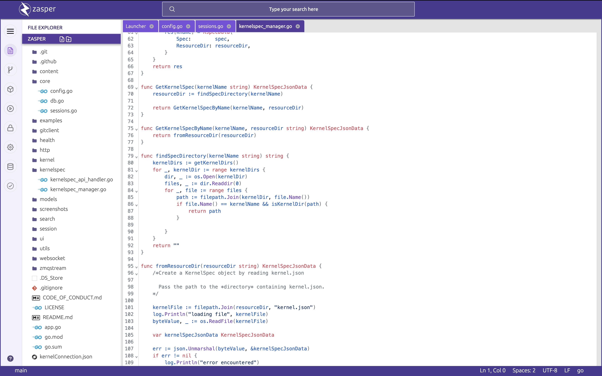
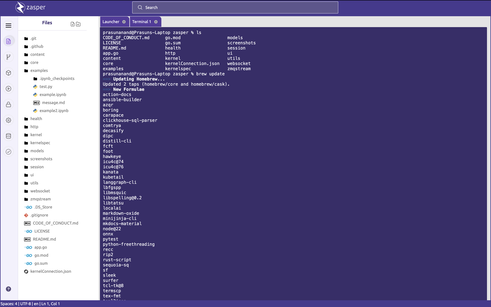
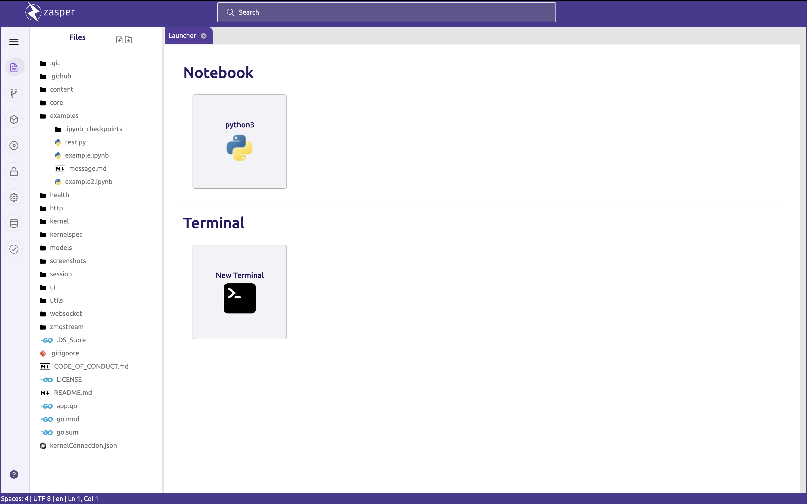
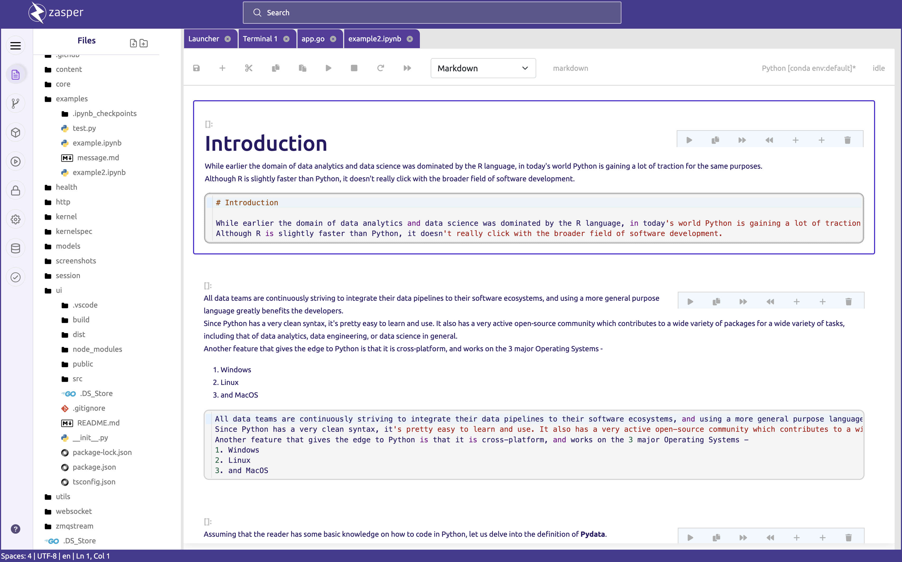
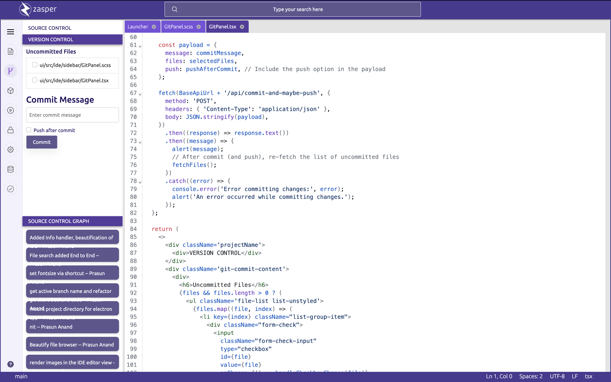
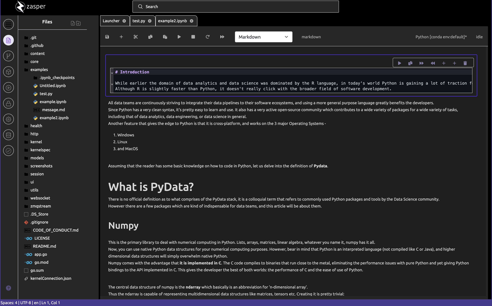

<p align="center">
  
</p>
<p align="center">
    ⚡ High Performance IDE 🚀 Powered by AI 🐥  Inspired by Jupyter
</p>

<p align=center>
  <a href="https://github.com/zasper-io/zasper" target="_blank">
      
  </a>
  <a href="https://github.com/zasper-io/zasper/stargazers" target="_blank">
      
  </a>
  <a href="https://github.com/zasper-io/zasper/issues" target="_blank">
      
  </a>
  <a href="https://github.com/zasper-io/zasper/actions/workflows/gobuild.yml" target="_blank"></a>
</p>

<p align=center>
  
</p>

# Why I built Zasper ?

A lot of properietary JupyterLab - like frontend software (Databricks Notebooks, Deepnote Notebooks)  are there in the market. But none of them are free and opensource. Also most of them force you to use them in the cloud. Even the modest personal computers these days have atleast 8 GBs of RAM, 8 core CPU and a descent GPU with 4 GB RAM. Hence, I decided to build this. 

Originally I wrote https://github.com/zasper-io/zasper_py(now in Private mode) to build a new frontend around Jupyter. During the process I realized, Go is the ideal choice to rebuild the Jupyter project. Go has excellent support for REST, RPC, WS protocols. Concurrency and Performance are the areas where Go shines.

Go's Concurrency: Better suited for applications requiring both concurrency and parallelism, as it leverages multiple cores effectively. It's easier to handle blocking operations without freezing the system.

Python's Event Loop: Ideal for I/O-bound applications that need to handle a lot of asynchronous tasks without blocking. However, it struggles with CPU-bound tasks and lacks native parallelism unless additional worker threads are used.

Hence the Go version of Zasper was born! Currently Zasper is supported on Linux and Mac. 


## 📷 Screenshots

### Editor


### Terminal


### Launcher
 

### Jupyter Notebook
 

### Version Control
 

### Command Palette


### Dark Mode
 

## ⚡️ Quick start

Zasper comes in two flavours:

1. Electron App
2. Web App

### Electron App


#### Install zeromq
On debian
```bash
sudo apt-get install libzmq3-dev
```

On mac
```zsh
brew install pkg-config
brew install zeromq
```


Go to project home and start the server

```bash
go build -o ui/public/zasper app.go
```

Go to `ui` and run the app in dev mode

```
npm run electron-dev       # dev-mode

npm run electron-package   # prod-mode
```


### Webapp

#### Build the frontend

```bash
cd ./ui/
npm run build
```

#### Install zeromq
On debian
```bash
sudo apt-get install libzmq3-dev
```

On mac
```zsh
brew install pkg-config
brew install zeromq
```

#### Start the backend

Install zeromq.

Go to project home and start the server

```bash
go build -tags webapp
```
This will crate a binary called `zasper`. Now add this binary to your path. 

Run zasper in any directory to see if the installation was done correctly.

```
% zasper -h
Usage of ../zasper:
  -cwd string
    	base directory of project (default ".")
  -debug
    	sets log level to debug
  -port string
    	port to start the server on (default ":8888")
```


Go to any directory you want to serve and run `zasper`. This starts zasper server in the directory.
```
% zasper 
2024/12/15 20:39:12 Zasper Server started! Listening on port:8888

███████╗ █████╗ ███████╗██████╗ ███████╗██████╗ 
╚══███╔╝██╔══██╗██╔════╝██╔══██╗██╔════╝██╔══██╗
  ███╔╝ ███████║███████╗██████╔╝█████╗  ██████╔╝
 ███╔╝  ██╔══██║╚════██║██╔═══╝ ██╔══╝  ██╔══██╗
███████╗██║  ██║███████║██║     ███████╗██║  ██║
╚══════╝╚═╝  ╚═╝╚══════╝╚═╝     ╚══════╝╚═╝  ╚═╝

```

Go to `http://localhost:8888`


## Logging

By default, the application writes logs to the following locations:

```bash
on Linux: ~/.config/zasper/logs/main.log
on macOS: ~/Library/Logs/zasper/main.log
on Windows: %USERPROFILE%\AppData\Roaming\zasper\logs\main.log
```

# Wiki

For Zasper architecture, timeline, and other info refer [wiki](https://github.com/zasper-io/zasper/wiki).

# Contributing

You can contribute in multiple ways:
* Documentation
* Bug Filing
* Submitting PRs or reviewing them

# Code of Conduct

See [Code of conduct](./CODE_OF_CONDUCT.md)

# TODOs

* Design a Plugin System
* Implement Language Server Protocol (LSP)
* Implement Linters and Compilers

# Copyright

Prasun Anand 

## ⚖️ License

Zasper is licensed under AGPL-3.0 license.
