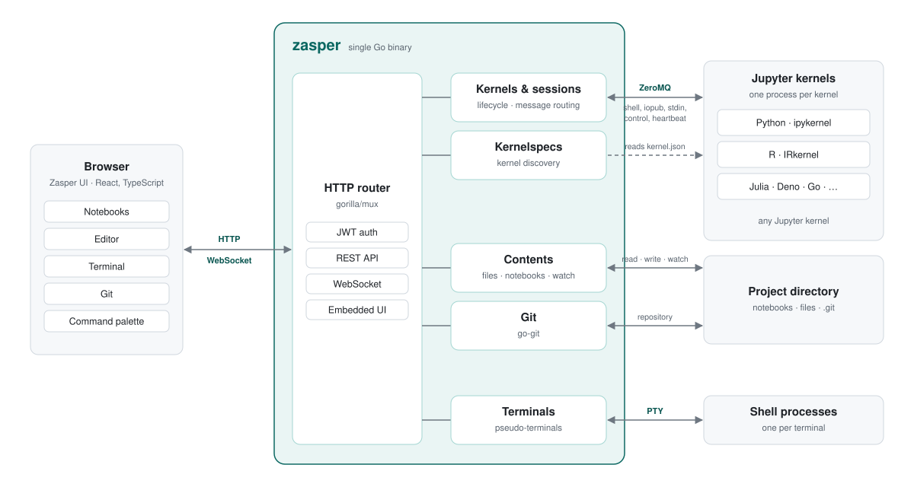

<p align="center">
  
</p>
<p align="center">
    ⚡ High Performance IDE 🚀 Massive concurrency 🐥  Inspired by Jupyter
</p>

<p align=center>
  <a href="https://github.com/zasper-io/zasper" target="_blank">
      
  </a>
  <a href="https://github.com/zasper-io/zasper/stargazers" target="_blank">
      
  </a>
  <a href="https://github.com/zasper-io/zasper/issues" target="_blank">
      
  </a>
  <a href="https://github.com/zasper-io/zasper/actions/workflows/gobuild.yml" target="_blank"></a>
</p>

<p align="center">
  <a href="https://snapcraft.io/zasper" target="_blank"></a>
</p>

Zasper is an IDE designed from the ground up to support massive concurrency. It provides a minimal memory footprint, exceptional speed, and the ability to handle numerous concurrent connections.

It implements [Jupyter's wire protocol](https://jupyter-client.readthedocs.io/en/latest/messaging.html) and can efficiently run Jupyter Notebooks.

# Cross Platform

✅ Fully supported: macOS & Linux

⚠️ Windows: binaries are published and Zasper runs, but the terminal and some
kernel paths are less well exercised there. For the best experience, use WSL.


# Benchmarks

How is Zasper better than JupyterLab ?


* Up to 5X Less CPU usage
* Up to 40X Less RAM usage
* Higher throughput
* Lower latency
* Highly resilient under very high loads

Benchmark comparision report can be accessed [here](https://github.com/zasper-io/zasper-benchmark?tab=readme-ov-file#benchmarking-zasper-vs-jupyterlab).


# Jupyter Kernels Supported

* Python Kernels
* Conda environments
* R kernels [(iR)](https://github.com/IRkernel/IRkernel)
* Julia Kernels [(iJulia)](https://julialang.github.io/IJulia.jl/stable/)
* Ruby kernels [(iRuby)](https://github.com/SciRuby/iruby)
* Javascript kernels [(Deno)](https://docs.deno.com/runtime/reference/cli/jupyter/)
* Go Kernels ([GoNb](https://github.com/janpfeifer/gonb))
* Compatible with all Jupyter kernels
* Also works with UV. See the section on "Working with conda environments".

# 📋 System Requirements

- **A Jupyter kernel.** Zasper runs notebooks on Jupyter kernels but does not
  install one. `pip install ipykernel` is enough to get started; see
  [Jupyter kernels](#jupyter-kernels) below for the full picture.
- **Python 3.8+**, if you are using the Python kernel.
- **A modern browser.** Zasper serves its interface locally and you open it in
  Chrome, Firefox, Safari or Edge — it is not a separate desktop application.

Zasper itself is a single static binary with no runtime dependencies. Without a
kernel installed it still starts, and the Launcher tells you what to install.

# 🚀 Installation

Zasper is distributed as a web app, available as a Homebrew, snap and conda package.

### HomeBrew

```
brew tap zasper-io/tap
brew trust zasper-io/tap
brew install zasper-io/tap/zasper
```

Homebrew 6 loads nothing from a third-party tap until you trust it, which is what
`brew trust` records. Without that step the install is refused.

Installed 0.x through Homebrew? Run `brew uninstall zasper` first: from 1.0 Zasper
is published as a cask rather than a formula.

### Snap

```
sudo snap install zasper
```

### Conda

```
conda install zasper -c conda-forge
```

### Releases

Visit our [downloads page](https://zasper.io/downloads)

Or directly install from releases.

Docker images are built from `docker/`; see
[PUBLISHING.md](PUBLISHING.md#docker).

# Releases

Current release version: `v1.0.0`

Every release ships a signed, notarized macOS build and static binaries for Linux
and Windows. The Linux archives are plain tarballs — one build serves every
distribution, Debian and Red Hat alike; there is no `.deb` or `.rpm` yet.

| Platform       | Architecture   | Archive                                |
|----------------|----------------|----------------------------------------|
| macOS 🍏       | Apple Silicon  | `zasper-webapp-<version>-darwin-arm64.tar.gz` |
| macOS          | Intel          | `zasper-webapp-<version>-darwin-amd64.tar.gz` |
| Linux          | x86-64         | `zasper-webapp-<version>-linux-amd64.tar.gz`  |
| Linux          | ARM64          | `zasper-webapp-<version>-linux-arm64.tar.gz`  |
| Linux          | i386           | `zasper-webapp-<version>-linux-386.tar.gz`    |
| Windows        | x86-64         | `zasper-webapp-<version>-windows-amd64.zip`   |
| Windows        | ARM64          | `zasper-webapp-<version>-windows-arm64.zip`   |
| Windows        | i386           | `zasper-webapp-<version>-windows-386.zip`     |

Each release also carries a `checksums.txt`; verify a download with
`sha256sum -c checksums.txt --ignore-missing`.

## 📷 Screenshots

### Editor


### Terminal


### Launcher


### Jupyter Notebook


### Version Control


### Command Palette


### Dark Mode


## ⌨️ Keyboard shortcuts

Every action listed here is also in the command palette (`⇧⌘P` / `Ctrl+Shift+P`), which shows each
command's chord beside it — so the palette, not this table, is the thing to reach for when you have
forgotten one.

Where a row gives two chords for macOS, both work. `⌘` is the usual editor convention and `⌃` is what
Zasper was bound to first; neither was taken away.

### Global

| Action | macOS | Windows / Linux |
| --- | --- | --- |
| Show All Commands | `⇧⌘P` or `⌃⇧P` | `Ctrl+Shift+P` |
| Go to File | `⇧⌘O` or `⌃⇧O` | `Ctrl+Shift+O` |
| Zoom In | `⌘=` or `⌘+` | `Ctrl+=` or `Ctrl++` |
| Zoom Out | `⌘-` | `Ctrl+-` |
| Reset Zoom | `⌘0` | `Ctrl+0` |

Zoom scales the whole window, chrome included. To change only the size of code, terminal text and
cell output, use **Increase / Decrease Font Size** from the palette — those have no chord.

### Notebook

| Action | macOS | Windows / Linux |
| --- | --- | --- |
| Save Notebook | `⌘S` or `⌃S` | `Ctrl+S` |
| Run Cell | `⌃⏎` | `Ctrl+Enter` |
| Run Cell and Select Next | `⇧⏎` | `Shift+Enter` |
| Insert Cell Above | `⌃⇧A` | `Ctrl+Shift+A` |
| Insert Cell Below | `⌃⇧B` | `Ctrl+Shift+B` |
| Move Cell Up | `⌃⇧↑` | `Ctrl+Shift+Up` |
| Move Cell Down | `⌃⇧↓` | `Ctrl+Shift+Down` |
| Delete Cell | `⌃⇧D` | `Ctrl+Shift+D` |
| Undo Cell Operation | `⇧⌘Z` | `Ctrl+Shift+Z` |
| Change Cell to Code | `⌃⇧Y` | `Ctrl+Shift+Y` |
| Change Cell to Markdown | `⌃⇧M` | `Ctrl+Shift+M` |

Cell operations are on `⌃⇧` rather than a bare `⌃` on purpose: `⌃A`, `⌃B`, `⌃E` and `⌃K` are the
system text-editing bindings on macOS, and `Ctrl+A` is select-all everywhere else, so a bare chord
would be swallowed before the cell's editor saw it.

**Undo Cell Operation** is the notebook's own history — it takes back an inserted, deleted, cut,
pasted or retyped cell, and a cleared output. `⌘Z` inside a cell is CodeMirror's, and still undoes
the text you typed there.

**Move Cell Up / Down** reorders the notebook and is not the same as **Select Next / Previous
Cell**, which only moves the selection. The cell's hover toolbar has both pairs: chevrons move the
selection, arrows move the cell. The focus travels with the cell, so the chord can be held to carry
one cell several places.

These have no chord and live in the palette: **Run All Cells**, **Cut / Copy / Paste Cell**,
**Select Next / Previous Cell**, **Change Cell to Raw**, **Expand or Collapse Output**,
**Clear Cell Output**, **Clear All Outputs**, **Interrupt Kernel**, **Restart Kernel**,
**Restart Kernel and Run All Cells**, **Reconnect to Kernel** and **Change Kernel**. The notebook
toolbar and a cell's hover toolbar reach most of them in one click.

### Inside a cell

These belong to the editor rather than to a command, because what they do depends on where the
cursor is.

| Key | What it does |
| --- | --- |
| `Tab` | Accepts the highlighted completion; with a word to the left of the cursor, asks the kernel for completions; otherwise indents |
| `↑` on the first line, `↓` on the last | Moves to the cell above or below |
| Double-click, or `Enter` on a selected markdown cell | Opens its source for editing |
| `Escape`, or running the cell, in a markdown cell | Renders it again |

A single click on a rendered markdown cell only selects it — it stays rendered.

## 📓 Notebook feature support

Zasper implements Jupyter's wire protocol and reads and writes the `.ipynb`
format directly, so notebooks move between Zasper and JupyterLab unchanged. Two
guarantees are worth stating outright:

- **A save produces no spurious diff.** A notebook Zasper opens and saves comes
  out byte-for-byte the file Jupyter would have written, so saving does not
  manufacture merge conflicts.
- **A file keeps its own nbformat minor version.** A 4.2 notebook is written back
  as 4.2 rather than silently upgraded to the newest revision, which is what
  JupyterLab does. Notebooks in formats 2 and 3 are converted to 4.5 on read.

### What renders

| Output | Status |
|---|:---:|
| `text/plain`, stdout/stderr, tracebacks | ✅ |
| `text/html` | ✅ |
| `image/png` | ✅ |
| Plotly figures (`application/vnd.plotly.v1+json`) | ✅ |
| ipywidgets (`application/vnd.jupyter.widget-view+json`) | ✅ |
| `application/json` | ✅ |
| Markdown cells — GFM tables, task lists, raw HTML, LaTeX via KaTeX | ✅ |
| `image/svg+xml` | ❌ not yet |
| `text/latex` | ❌ not yet |
| `image/jpeg` | ❌ not yet |

The three gaps are worth knowing before you hit them: `text/latex` is what SymPy
emits from `init_printing()`, `image/svg+xml` is what graphviz and networkx
produce and what matplotlib produces under
`%config InlineBackend.figure_format = 'svg'`, and `image/jpeg` covers
`display()` of a JPEG. Their cells run correctly — only the rendering is missing.
They are the first thing on the list after 1.0.

### Known limitations

- **Widget state is not written into the notebook.** Reopening a notebook without
  a running kernel shows a placeholder rather than the widget's last rendered
  state; run the cell again to draw it.
- **A cell's own output area ignores `clear_output`.**
- **Notebooks are not signed or trusted.** Zasper does not yet implement
  Jupyter's signature database, and stored `text/html` output can carry scripts
  that run when the notebook is opened — which is how Plotly and Bokeh outputs
  draw themselves. Treat a notebook you did not write the way you would treat any
  downloaded file.

## Architecture



## Quickstart


### Webapp

Once you have the webapp installed, Go to any directory you want to serve and run `zasper`. This starts zasper server in the directory.

```
prasunanand@Prasuns-Mac-mini example % zasper
==========================================================
     ███████╗ █████╗ ███████╗██████╗ ███████╗██████╗
     ╚══███╔╝██╔══██╗██╔════╝██╔══██╗██╔════╝██╔══██╗
       ███╔╝ ███████║███████╗██████╔╝█████╗  ██████╔╝
      ███╔╝  ██╔══██║╚════██║██╔═══╝ ██╔══╝  ██╔══██╗
     ███████╗██║  ██║███████║██║     ███████╗██║  ██║
     ╚══════╝╚═╝  ╚═╝╚══════╝╚═╝     ╚══════╝╚═╝  ╚═╝

                    Zasper Server
                Version: 1.0.0
----------------------------------------------------------
 ✅ Server started successfully!
 📡 Bound to:            127.0.0.1:8048
 🖥️  Webapp available at: http://127.0.0.1:8048
 🔐 Server Access Token: 14be1b674a3b9196a82c01129028d0dd
 🔗 Sign in with:        http://127.0.0.1:8048/?token=14be1b674a3b9196a82c01129028d0dd
 📊 Anonymous usage data: on  (--tracking=false to turn off)
                          see PRIVACY.md for what is sent
==========================================================

```

Zasper opens the **Sign in with** link in your default browser, so you arrive
already logged in. Pass `--no-browser` to leave it closed — for example when the
server runs on a machine you reach over SSH — and open the link yourself.


### 🚀 Hosting Zasper

Zasper always runs in protected mode: every route except the health check needs
a session, and a session comes from the access token printed at startup. To host
your own instance of Zasper, follow these steps:

### 1. Start the server

```sh
zasper --host=0.0.0.0 --no-browser
```

`--host` is what makes the server reachable from another machine. Zasper binds
`127.0.0.1` by default; widen it only when you mean to.

On startup, Zasper will display a banner with your server details:
```
==========================================================
     ███████╗ █████╗ ███████╗██████╗ ███████╗██████╗
     ╚══███╔╝██╔══██╗██╔════╝██╔══██╗██╔════╝██╔══██╗
       ███╔╝ ███████║███████╗██████╔╝█████╗  ██████╔╝
      ███╔╝  ██╔══██║╚════██║██╔═══╝ ██╔══╝  ██╔══██╗
     ███████╗██║  ██║███████║██║     ███████╗██║  ██║
     ╚══════╝╚═╝  ╚═╝╚══════╝╚═╝     ╚══════╝╚═╝  ╚═╝

                    Zasper Server
                Version: 1.0.0
----------------------------------------------------------
 ✅ Server started successfully!
 📡 Bound to:            127.0.0.1:8048
 🖥️  Webapp available at: http://127.0.0.1:8048
 🔐 Server Access Token: 14be1b674a3b9196a82c01129028d0dd
 🔗 Sign in with:        http://127.0.0.1:8048/?token=14be1b674a3b9196a82c01129028d0dd
==========================================================
```

### 2. Log in

Open the **Sign in with** link and you are logged in straight away; the page
takes the token back out of the address bar as soon as it has used it. Treat that
link like a password.

Or open [http://localhost:8048](http://localhost:8048), which redirects to the
login page, and paste the `Server Access Token` there.


### 3. Persistent token (optional)

A new access token is generated every time the server starts. To keep the same
one, so that a link you have handed out keeps working, set it yourself:

```sh
export ZASPER_TOKEN=your-access-token
```

Sessions are signed with a secret that is also random per process, so a restart
signs everyone out. To keep sessions alive across restarts, fix that too:

```sh
export ZASPER_JWT_SECRET=your-secret-here
```

## Jupyter kernels

Please ensure you have jupyter kernels installed.

```
prasunanand@Prasuns-Laptop examples % jupyter kernelspec list
Available kernels:
  deno          /Users/prasunanand/Library/Jupyter/kernels/deno
  firstenv      /Users/prasunanand/Library/Jupyter/kernels/firstenv
  gonb          /Users/prasunanand/Library/Jupyter/kernels/gonb
  ir            /Users/prasunanand/Library/Jupyter/kernels/ir
  julia-1.11    /Users/prasunanand/Library/Jupyter/kernels/julia-1.11
  ruby3         /Users/prasunanand/Library/Jupyter/kernels/ruby3
  python3       /Users/prasunanand/Library/Python/3.9/share/jupyter/kernels/python3
```
The simplest way to install a Python 3 Jupyter kernel is

```
pip install ipykernel
```

or

```
pip install jupyter
```

## Working with conda environments

Create an environment.
```
conda create --name torchEnv
```

Activate the environment.
```
conda activate torchEnv
```

Install the necessary packages and ipykernel

```
conda install -c anaconda ipykernel
```

Create `kernelspec` file and you are done! 🚀

```
python -m ipykernel install --user --name=torchEnv
```

## Working with UV

Create a project.
```
uv init exampleUV
cd exampleUV
uv run main.py    # This creates a .venv directory
```

Activate the environment.
```

source .venv/bin/activate
```

Install the necessary packages and ipykernel

```
uv pip install ipykernel
```

Create `kernelspec` file and you are done! 🚀

```
uv run python -m ipykernel install --user --name=exampleUV
```

## ⚡️ Building from Source

Requires Go 1.25+ and Node.js 22.12+ (`.nvmrc` pins the Node version, so
`nvm use` picks it up).

#### Initializing

Download `zasper` from Github and initialize the dependencies.

```
git clone https://github.com/zasper-io/zasper
cd zasper
make init
```

#### Web App

```
make webapp-install
```

This will create a binary `zasper` and add it to your go executables directory. Make sure you have go executables on your path.

Run zasper in any directory to see if the installation was done correctly.

```
prasunanand@Prasuns-Laptop example % zasper --help
Usage of zasper:
  -cwd string
    	base directory of project (default ".")
  -debug
    	sets log level to debug
  -no-browser
    	do not open the app in a browser on startup
  -port string
    	port to start the server on (default ":8048")
```

# 🪵 Logging

The server writes logs to standard output. Run it with `-debug` to raise the log level:

```bash
zasper -debug
```

# 🔒 Privacy

Zasper sends a small amount of anonymous usage data: counts of things like notebooks opened, cells
run and terminals started. It never sends file names, paths, code, project names, your username or
your IP address, and there is no session recording or autocapture.

[PRIVACY.md](PRIVACY.md) lists every event and every property, and explains how the allowlist that
enforces it works. To turn tracking off:

```bash
zasper --tracking=false     # this run
ZASPER_TELEMETRY=0 zasper   # this run, from the environment
```

Or clear **Settings → Privacy → Send anonymous usage data**, which is remembered. With tracking off
nothing is collected and no request is made.

# 🧭 Roadmap

Data Scientists and AI Engineers spend most of their time running Notebooks on IDEs and hence need a robust ecosystem.
Zasper aspires to be a full fledged IDE and the future development will be along making it more efficient by:

* Allowing custom data apps support rather than just Jupyter Notebooks.
* Easier integration with the existing tools.
* Zasper Hub for Self Hosted deployment in the cloud.


# 🤞 Support Zasper

If you like using Zasper and want to support me in my mission, please consider [sponsoring me on GitHub](https://github.com/sponsors/prasunanand).


#  🚀 Sponsors

A few months ago I received a grant to help me building Zasper.

 &nbsp;&nbsp;&nbsp;&nbsp; 


# 🌐 Community

Join Zasper Community on [Slack](https://join.slack.com/t/zasper/shared_invite/zt-30sx3uo8w-w~sw4Kje1aoUjxY5MZ_Fkg)

<p align=center>
  <a href="https://join.slack.com/t/zasper/shared_invite/zt-30sx3uo8w-w~sw4Kje1aoUjxY5MZ_Fkg" target="_blank">
      
  </a>
</p>

# Contributors

<a href = "https://github.com/zasper-io/zasper/graphs/contributors">
  
</a>

# Documentation

- [CHANGELOG.md](CHANGELOG.md) — what changed in each release.
- [docs/API.md](docs/API.md) — the HTTP and WebSocket API, which is covered by
  semantic versioning from 1.0.0 onwards.
- [PRIVACY.md](PRIVACY.md) — what anonymous usage data is collected, event by event.
- [PUBLISHING.md](PUBLISHING.md) — how releases are cut.
- [CONTRIBUTING.md](CONTRIBUTING.md) — how to build and contribute.

# Contributing

You can contribute in multiple ways:
* Documentation
* Bug Filing
* Submitting PRs or reviewing them

# ⭐️ Star History

[](https://star-history.com/#zasper-io/zasper&Date)

# Code of Conduct

See [Code of conduct](./CODE_OF_CONDUCT.md)

# 🙏 Thanks to Jupyter Community

Zasper would not exist without the incredible work of the Jupyter community. Zasper uses the Jupyter wire protocol and draws inspiration from its architecture. Deep thanks to all Jupyter contributors for laying the groundwork. Data Science Notebooks would not have existed without them.

# Copyright

Prasun Anand

## ⚖️ License

Zasper is licensed under the GNU Affero General Public License, version 3 only
(`AGPL-3.0-only`). See [LICENSE](LICENSE).
