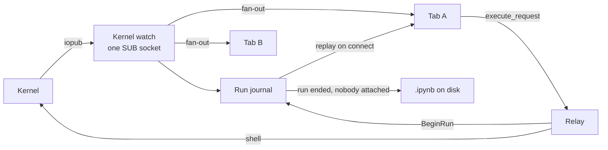

# Runs that outlive the browser

Start a long cell, close the laptop, and come back: every line it printed is there. A cell's output
no longer depends on a browser tab being open to receive it.

- A tab that loses its connection mid-run reconnects by itself and is given what it missed, then
  follows the rest of the run live.
- A run that finishes while no tab is open has its outputs written into the `.ipynb`, so the file is
  complete the next time anything reads it.

This page is how that works, for anyone changing the kernel, the relay or the notebook editor.

## Why Jupyter loses output

In JupyterLab the browser turns kernel messages into notebook outputs. The server forwards iopub
messages over the websocket and keeps nothing, so whatever a kernel publishes while no browser is
listening is gone; the kernel keeps running, but there is nothing to replay. Zasper used to work the
same way: every websocket connection opened iopub sockets of its own and forwarded what arrived.

## The pieces



| Piece | Where | What it does |
| --- | --- | --- |
| Kernel watch | `internal/kernel/kernel_activity.go` | The kernel's only iopub subscription, alive as long as the kernel. |
| Feed and run journal | `internal/kernel/runs.go` | Folds each run's messages into nbformat outputs, and fans every message out to the attached tabs. |
| Relay | `internal/kernelws/connection.go` | Registers each `execute_request` with the journal, and feeds the tab from the journal instead of a socket of its own. |
| Disk write | `internal/content/run_outputs.go`, wired in `internal/server/server.go` | Puts a finished run's outputs into its cell in the file. |
| Replay | `ui/src/ide/editor/notebook/useKernelSession.ts`, `kernelMessages.ts`, `useCellOutputs.ts` | Places replayed runs into cells and brings the running-cell spinners into line. |
| Reconnect | `ui/src/ide/editor/notebook/useKernelReconnect.ts`, `useKernelSocket.ts` | Reopens a dropped socket while the kernel lives. |

## One subscription per kernel

The watch that `/api/kernels` already used to report a kernel's state is now the kernel's only
iopub subscriber. Each message is decoded once, folded into the journal, then copied to every
attached tab's channel.

That single path is what makes replay exact. Subscribing takes the journal's snapshot and registers
the tab under one lock, so the replay holds everything up to that instant and the channel holds
everything after it: nothing is replayed twice and nothing falls in between. With a socket per tab,
two subscribers receive the same stream at different moments, and no snapshot taken from one lines
up with the other.

A tab that falls more than 4,096 messages behind is dropped rather than allowed to hold up the
kernel. Dropping is safe: the tab reconnects and is replayed what it lost.

## The run journal

The relay calls `BeginRun(msgId, cellId, code)` for every non-silent `execute_request` before it
reaches the kernel, so the run exists in the journal before its first output. The cell id comes from
the request's `metadata.cellId`, which the editor already sends.

Every iopub message whose `parent_header.msg_id` names a run is folded the way the editor folds it:

| Message | Effect on the run |
| --- | --- |
| `execute_input` | Sets the execution count. |
| `stream` | Appends text, joined onto the previous stream output of the same name, as nbformat stores it. |
| `execute_result`, `display_data`, `error` | Appends an nbformat output, with `metadata` defaulted. |
| `clear_output` | Empties the outputs; with `wait: true`, the next output replaces them instead. |
| `status: idle` | Marks the run done. |

A run is **missed** if any of its messages arrived while no tab was attached. What happens when it
ends depends on that:

| When the run ends | What happens |
| --- | --- |
| A tab saw all of it | Dropped from the journal; the tab has the output. |
| It was missed, and a tab is attached now | Kept, and given to the next tab that connects. |
| It was missed, and nobody is attached | Kept, and its outputs are written into the file. |

A tab that connects is given every run still going, and every finished run that was missed. The
finished ones are handed over once and then dropped, so output a user has since cleared and saved
cannot come back on a later reopen.

**Limits.** A run keeps at most 8 MB of output; past that the oldest outputs go first. A single
stream keeps its last 1 MB, cut at a line boundary, since the end of a long log is what gets read.
A kernel's journal holds at most 1,000 runs.

## The replay message

The first message on every kernel websocket is a replay, sent before any kernel message:

```json
{
  "channel": "zasper",
  "header": { "msg_id": "…", "msg_type": "zasper_replay" },
  "content": {
    "runs": [
      {
        "msg_id": "…",
        "cell_id": "count",
        "code": "for i in range(16): …",
        "execution_count": 1,
        "outputs": [{ "output_type": "stream", "name": "stdout", "text": "step 0\n…" }],
        "clear_waiting": false,
        "done": true,
        "execution": {
          "iopub.status.busy": "2026-10-08T09:48:16.011Z",
          "iopub.execute_input": "2026-10-08T09:48:16.012Z",
          "shell.execute_reply": "2026-10-08T09:48:22.019Z"
        }
      }
    ]
  }
}
```

`runs` is empty when there is nothing to replay. The message is documented in [API.md](API.md).

## Placing a run in its cell

A run belongs to the cell its `cell_id` names. A notebook older than nbformat 4.5 has no ids on
disk, and the editor makes new ones on every load, so the id from an earlier tab may match nothing.
Then the run belongs to the one code cell whose source is the code that ran. If two cells hold that
code, the run goes nowhere: lighting up the wrong cell would write this run's output over someone
else's. The same rule places runs started by another client (see `findRunCell` in
`kernelMessages.ts`), and the server applies it when writing to disk (`runCell` in
`run_outputs.go`).

## In the editor

When the replay arrives, `useKernelSession` hands it to the notebook:

- Each run's outputs and execution count replace its cell's. A cell already showing exactly that
  output keeps its object, so a notebook reopened after its file was written is not marked unsaved.
  Replayed outputs are marked as produced by this page, like live ones, so their HTML can run.
- A run still going is adopted: its `msg_id` is mapped to the cell, so the live messages that follow
  land there and the cell shows a spinner. A pending `clear_output(wait=True)` is carried over.
- Any cell this tab thought was running, whose run the server no longer lists as running, stops
  spinning. Requests sent on the new socket are exempt, since the replay was taken before they
  existed.

## Reconnecting

When the kernel socket closes, the editor asks `GET /api/kernels/{id}`. A `404` means the kernel has
stopped and nothing is reopened. Any other failure is taken to be the network, and the editor tries
again after 1s, doubling up to 15s, and at once on the browser's `online` and `pageshow` events.
Restarting the kernel or switching to another one cancels the attempts, since the socket that
dropped is no longer the tab's.

**The back/forward cache.** Chrome keeps a page you navigate away from frozen, with its websockets
still open. The server saw that as a tab still watching, so a run left behind that way was never
missed. A notebook page now closes its kernel socket on `pagehide` when the page is being cached,
and the `pageshow` on return reconnects and replays.

## Writing to disk

`WriteRunOutputs` reads the notebook through `internal/nbformat`, sets the run's cell's `outputs`
and `execution_count`, and its `metadata.execution` while cell times are kept (below), and writes
it back atomically. Nothing else in the file changes, and the bytes are what nbformat would write. The notebook is found by the kernel's current session, so a
renamed notebook is written under its new name. A cell that cannot be found leaves the file alone.

## Cell times

Each code cell says how long its last run took, in its box's bottom border, counting up while the
kernel is on it and saying `queued` while it waits behind another cell. The time runs from
`execute_input` to `execute_reply`: the kernel's own time, not the queue's. Hovering it gives when
the cell started and finished, and how long it waited, which is known only for a run this page sent.

The times are kept in the cell's `metadata.execution` under JupyterLab's four keys
(`iopub.status.busy`, `iopub.execute_input`, `shell.execute_reply.started`,
`shell.execute_reply`), as its Record timing setting writes them, so a notebook timed in either
reads the same in the other. A run that finishes with no tab open gets them from the server, which
sees `status: busy` and `execute_input` on iopub and takes the closing `status: idle` for the reply,
since it does not see the shell channel. Settings → Notebook → *Keep cell times in the file* turns
the writing off: the times are still shown, and a re-run then changes only outputs and counts.

| File | What it does |
| --- | --- |
| `ui/src/ide/editor/notebook/CellTime.tsx` | The time in the border, the running count and the tooltip. |
| `ui/src/ide/editor/notebook/kernelMessages.ts` | `nextTiming`, and writing it into `metadata.execution`. |
| `ui/src/ide/editor/notebook/useCellOutputs.ts` | The times this page saw, whether or not they are kept. |
| `internal/kernel/runs.go` | A run's times, for the replay and the file. |

## What it does not do

- **Edits made while away.** A tab that slept with unsaved edits, whose file was written meanwhile,
  shows the "changed on disk" band when it wakes. Nothing is lost, but the user is asked.
- **Two tabs, both away.** A finished run is handed to the first tab that reconnects; a second tab
  on the same notebook that was also away does not get it.
- **Runs Zasper did not relay.** A client that talks to the kernel directly never registers its
  run, so nothing is kept for it.
- **Server restarts.** The journal is in memory and goes with the kernel. Output already written to
  the file stays.

## Tests

| Test | Covers |
| --- | --- |
| `internal/kernel/runs_test.go` | Folding, who is replayed what, clears, the finished callback, dropping a slow tab, stream trimming. |
| `internal/content/run_outputs_test.go` | Byte-identical writes, matching by code in a 4.4 file, refusing an ambiguous match. |
| `internal/server/run_journal_e2e_test.go` | A real kernel: a socket dropped mid-run is replayed, and a run with no tab open reaches the file. |
| `ui/src/ide/editor/notebook/NotebookEditor.replay.test.tsx` | Replay into cells, adopting a live run, cells without ids, reconnecting, a stopped kernel, the back/forward cache. |
